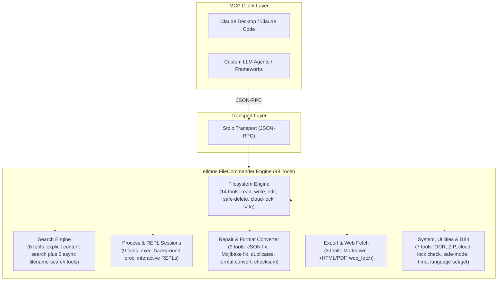
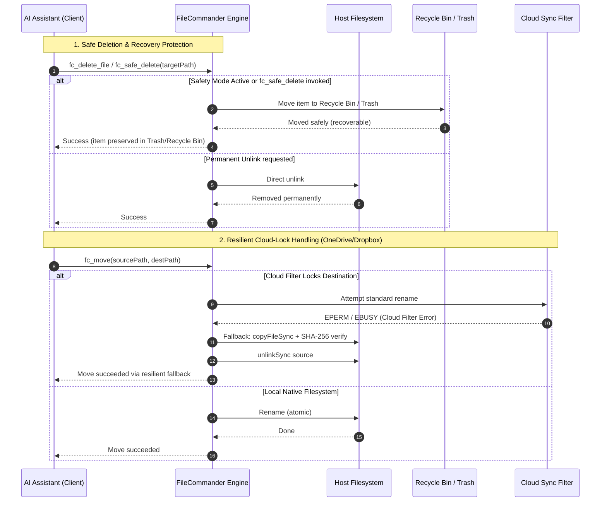

<p align="center">
  
</p>

# ellmos FileCommander MCP Server

**🇩🇪 [Deutsche Version](README_de.md)**

*Part of the [ellmos-ai](https://github.com/ellmos-ai) family.*

[](https://opensource.org/licenses/MIT)
[](https://github.com/ellmos-ai/ellmos-filecommander-mcp/actions/workflows/tests.yml)
[](https://www.npmjs.com/package/ellmos-filecommander-mcp)
[](https://nodejs.org/)
[](#tools-overview)
[-brightgreen.svg)](#testing)
[](SECURITY.md)
[](#why-filecommander)
[](https://github.com/ellmos-ai)
[](https://github.com/open-bricks)
[](llms.txt)

> **Quick Navigation:** [Tools Overview](#tools-overview) | [System Architecture](#system-architecture) | [Core Capabilities & Safety Invariants](#core-capabilities--safety-invariants) | [Installation](#installation) | [Configuration](#configuration) | [Comparison](#comparison-with-alternatives) | [Discoverability](#discoverability) | [Security](#security) | [Ecosystem](#ellmos-ai-ecosystem) | [Security Policy](SECURITY.md) | [Changelog](CHANGELOG.md) | [llms.txt](llms.txt)

A comprehensive **Model Context Protocol (MCP) server** that gives AI assistants full filesystem access, bounded multi-file content search, process management, interactive shell sessions, and async filename search capabilities.

**48 tools** in a single server - everything an AI agent needs to interact with the local system.

**Discovery keywords:** local filesystem MCP server, multi-file content search MCP, safe delete MCP, Recycle Bin MCP server, process management MCP, interactive shell MCP, async file search for AI agents, cloud-lock-safe file operations, Markdown to PDF MCP, OCR MCP server, ZIP archive MCP.

**Registry status:** published on [npm](https://www.npmjs.com/package/ellmos-filecommander-mcp), indexed by [jsDelivr](https://www.jsdelivr.com/package/npm/ellmos-filecommander-mcp), visible on [LobeHub](https://lobehub.com/mcp/ellmos-ai-ellmos-filecommander-mcp), listed on [Glama](https://glama.ai/mcp/servers/ellmos-ai/ellmos-filecommander-mcp), and prepared for the official MCP Registry via [`server.json`](server.json). Some third-party directories still show older 43-tool metadata, so the canonical README/npm metadata should remain the source of truth until their reindex catches up.

> [!NOTE]
> **For AI Agents & LLM Integrations:**
> FileCommander provides **48 specialized tools** accessible via standard stdio transport. All tool names use the `fc_` prefix to prevent namespace collisions. For LLMs, compact context and schema overviews are available in [`llms.txt`](llms.txt) and [`server.json`](server.json).

---

## Why FileCommander?

Most filesystem MCP servers only cover basic read/write operations. FileCommander goes further:

- **Safe Delete** - Moves files to Recycle Bin (Windows) or Trash (macOS/Linux) instead of permanent deletion
- **Interactive Sessions** - Start and interact with REPLs (Python, Node.js, shells) through the MCP protocol
- **Async Search** - Search large directory trees in the background while the AI continues working
- **Explicit Content Search** - Search literal text or regex across a bounded list of files without recursion or glob expansion
- **Process Management** - List, start, and terminate system processes
- **String Replace** - Edit files by matching unique strings with context validation
- **Format Conversion** - Convert between JSON, CSV, INI, YAML, TOML, XML, and TOON
- **ZIP Archives** - Create, extract, and list ZIP archives
- **File Checksums** - MD5, SHA-1, SHA-256, SHA-384, and SHA-512 hashing with compare
- **OCR** - Extract text from images (optional tesseract.js dependency)
- **Safety Mode** - Toggle to route all deletes through Recycle Bin / Trash
- **Markdown Export** - Convert Markdown to professional HTML/PDF with code blocks, tables, nested lists, blockquotes
- **Cloud-Lock Safe** - Automatic copy+delete fallback when cloud sync filters (OneDrive, Dropbox, Google Drive, iCloud) block rename operations
- **Cloud Lock Diagnosis** - Check whether a path is at risk of sync-filter conflicts before operating
- **Cross-platform** - Works on Windows, macOS, and Linux with platform-specific optimizations

---

## System Architecture





---

## Core Capabilities & Safety Invariants

| Capability / Invariant | Guarantee & Implementation Details | Security & Operational Benefit |
|------------------------|-----------------------------------|--------------------------------|
| **Local stdio & explicit egress** | The MCP transport is local stdio, with no telemetry and no automatic network egress. `fc_web_fetch` makes outbound HTTP(S) requests only when a client explicitly invokes it; private targets are blocked by default unless `allow_private` is enabled. | Makes the network boundary visible to clients while retaining a local, port-free server transport. |
| **Safe Deletion & Trash Protection** | `fc_safe_delete` moves items to Windows Recycle Bin / macOS Trash / Linux FreeDesktop Trash. `fc_set_safe_mode` routes all deletes safely. | Prevents irreversible data loss from accidental recursive or bulk deletions. |
| **Cloud-Lock Resilient Move (`fc_move`)** | Automatic detection of cloud sync filters (OneDrive, Dropbox, iCloud reparse points) with seamless copy+verify+delete fallback. | Eliminates `EPERM` / `EBUSY` failures during automated agent operations in sync directories. |
| **Cloud-Lock Diagnosis (`fc_check_cloud_lock`)** | Pre-flight inspection for offline sync attributes, reparse points, and placeholder file states. | AI agents can avoid operating on un-hydrated or locked cloud files before execution. |
| **Bounded Multi-File Content Search** | `fc_search_content` strictly caps inputs (max 50 explicit files, 10 MB per file, 200 matches, 200k chars) without glob recursion. | Prevents out-of-memory errors and catastrophic CPU lockups during large repository searches. |
| **Automated Secret & Token Redaction** | Content search excerpts automatically mask common API keys, bearer tokens, AWS credentials, and authorization headers. | Prevents LLM context contamination and accidental credential leakage in prompt history. |
| **Interactive REPL & Session Isolation** | Stateful interactive sessions (`fc_start_session`, `fc_send_input`, `fc_read_output`) for Python, Node.js, bash, and PowerShell with bounded buffers. | Allows multi-turn REPL debugging without unconstrained background process buildup. |
| **Lossless Multi-Format Engine** | Declarative conversion (`fc_convert_format`) across 7 structured formats (JSON, YAML, TOML, XML, CSV, INI, TOON). | Clean data normalization across heterogeneous configuration formats without data loss. |
| **Mojibake & File Repair Engine** | `fc_fix_encoding`, `fc_fix_json`, and `fc_cleanup_file` repair broken UTF-8 encoding (27+ patterns), malformed JSON syntax, BOMs, and NUL bytes. | Self-healing pipelines for corrupted files generated across divergent OS platforms. |
| **Unprivileged Non-Elevation Execution** | Designed and verified to run in standard unprivileged user-mode. Never requires administrative or root privileges. | Minimal attack surface; adheres to the principle of least privilege. |
| **Six-language Runtime i18n Engine** | Dynamic language switching and introspection (`fc_set_language`, `fc_get_language`) for German (`de`), English (`en`), Spanish (`es`), Chinese (`zh`), Japanese (`ja`), and Russian (`ru`). | Native multilingual developer experience and localized error reporting. |
| **Multi-OS Verified Matrix** | Tested across Windows, Ubuntu Linux, and macOS on Node.js 20, 22, and 24 with 261 automated assertions. | Continuous cross-platform parity and reliability. |

---

## Installation

### Prerequisites

- [Node.js](https://nodejs.org/) 20 or higher
- npm

### Option 1: Install from NPM

```bash
npm install -g ellmos-filecommander-mcp
```

### Option 2: Install from Source

```bash
git clone https://github.com/ellmos-ai/ellmos-filecommander-mcp.git
cd ellmos-filecommander-mcp
npm install
npm run build
```

---

## Configuration

### Claude Desktop

Add to your `claude_desktop_config.json`:

**Windows:** `%APPDATA%\Claude\claude_desktop_config.json`
**macOS:** `~/Library/Application Support/Claude/claude_desktop_config.json`

#### If installed globally via NPM:

```json
{
  "mcpServers": {
    "filecommander": {
      "command": "ellmos-filecommander"
    }
  }
}
```

#### If installed from source:

```json
{
  "mcpServers": {
    "filecommander": {
      "command": "node",
      "args": ["/absolute/path/to/filecommander-mcp/dist/index.js"]
    }
  }
}
```

Restart Claude Desktop after saving.

### Other MCP Clients

The server communicates via **stdio transport**. Point your MCP client to the `dist/index.js` entry point or the `ellmos-filecommander` binary.

---

## Tools Overview

### Filesystem Operations (14 tools)

| Tool | Description |
|------|-------------|
| `fc_read_file` | Read file contents with optional line limit |
| `fc_read_multiple_files` | Read up to 20 files in a single call |
| `fc_write_file` | Write/create/append to files |
| `fc_edit_file` | Line-based editing (replace, insert, delete lines) |
| `fc_str_replace` | Replace a unique string in a file with context validation |
| `fc_list_directory` | List directory contents (recursive, configurable depth) |
| `fc_create_directory` | Create directories (including parents) |
| `fc_delete_file` | Delete a file (permanent) |
| `fc_delete_directory` | Delete a directory (with optional recursive flag) |
| `fc_safe_delete` | Move to Recycle Bin / Trash (recoverable!) |
| `fc_move` | Move or rename files and directories (cloud-lock safe) |
| `fc_copy` | Copy files and directories |
| `fc_file_info` | Get detailed file metadata (size, dates, type) |
| `fc_search_files` | Synchronous file search with wildcard patterns |

### Content Search (1 tool)

| Tool | Description |
|------|-------------|
| `fc_search_content` | Read-only literal or regex search within an explicit ordered list of files, with case, context, global, and per-file limits |

`fc_search_content` never expands globs, traverses directories, or recursively discovers files. It accepts at most 50 explicit UTF-8 text files, skips binary and files over 10 MB, and returns deterministic JSON. Matches are limited to 200 globally and 100 per file, context to 10 lines, excerpts to 500 characters, and serialized output to 200,000 characters. Missing, cloud-only, permission, encoding, binary, and size failures are reported per file so readable files still produce results. Common secret formats are redacted from excerpts.

### Async Search (5 tools)

| Tool | Description |
|------|-------------|
| `fc_start_search` | Start a background search (returns immediately) |
| `fc_get_search_results` | Retrieve results with pagination |
| `fc_stop_search` | Cancel a running search |
| `fc_list_searches` | List all active/completed searches |
| `fc_clear_search` | Remove completed searches from memory |

### Process Management (4 tools)

| Tool | Description |
|------|-------------|
| `fc_execute_command` | Execute a shell command (blocking, with timeout) |
| `fc_start_process` | Start a background process (non-blocking) |
| `fc_list_processes` | List running system processes |
| `fc_kill_process` | Terminate a process by PID or name |

### Interactive Sessions (5 tools)

| Tool | Description |
|------|-------------|
| `fc_start_session` | Start an interactive process (Python, Node, shell...) |
| `fc_read_output` | Read session output |
| `fc_send_input` | Send input to a running session |
| `fc_list_sessions` | List all sessions |
| `fc_close_session` | Terminate a session |

### File Maintenance & Repair (9 tools)

| Tool | Description |
|------|-------------|
| `fc_fix_json` | Repair broken JSON (BOM, trailing commas, comments, single quotes) |
| `fc_validate_json` | Validate JSON with detailed error position and context |
| `fc_cleanup_file` | Remove BOM, NUL bytes, trailing whitespace, normalize line endings |
| `fc_fix_encoding` | Fix Mojibake / double-encoded UTF-8 (27+ character patterns) |
| `fc_folder_diff` | Track directory changes with snapshots (new/modified/deleted) |
| `fc_batch_rename` | Pattern-based batch renaming (prefix/suffix, replace, auto-detect) |
| `fc_convert_format` | Convert between JSON, CSV, INI, YAML, TOML, XML, and TOON formats |
| `fc_detect_duplicates` | Find duplicate files using SHA-256 hashing |
| `fc_checksum` | File hashing (MD5, SHA-1, SHA-256, SHA-384, SHA-512) with optional compare |

### Archive (1 tool)

| Tool | Description |
|------|-------------|
| `fc_archive` | Create, extract, and list ZIP archives |

### OCR (1 tool)

| Tool | Description |
|------|-------------|
| `fc_ocr` | Extract text from images via tesseract.js (optional dependency) |

### Cloud Sync (1 tool)

| Tool | Description |
|------|-------------|
| `fc_check_cloud_lock` | Diagnose whether a path may be blocked by cloud sync filters (Windows) |

### System (4 tools)

| Tool | Description |
|------|-------------|
| `fc_get_time` | Get current system time with timezone info |
| `fc_set_safe_mode` | Toggle safe mode: all deletes go through Recycle Bin / Trash |
| `fc_set_language` | Set the runtime language (`de`, `en`, `es`, `zh`, `ja`, or `ru`) |
| `fc_get_language` | Read the active runtime language and all supported language codes |

### Export (2 tools)

| Tool | Description |
|------|-------------|
| `fc_md_to_html` | Markdown to standalone HTML with CSS styling (headers, code blocks, tables, nested lists, blockquotes, images, checkboxes) |
| `fc_md_to_pdf` | Markdown to PDF via headless browser (Edge/Chrome). Falls back to HTML if no browser is available |

### Web (1 tool)

| Tool | Description |
|------|-------------|
| `fc_web_fetch` | Fetch a web page and return content by `mode`: extract (clean main text), raw (HTTP body), links, forms, or headers. Read-only network tool; SSRF guard blocks internal/private targets by default. |

**Total: 48 tools**

---

## Comparison with Alternatives

| Feature | FileCommander | [Desktop Commander](https://github.com/wonderwhy-er/DesktopCommanderMCP) | [Official Filesystem](https://www.npmjs.com/package/@modelcontextprotocol/server-filesystem) |
|---------|:---:|:---:|:---:|
| File read/write/copy/move | 14 tools | Yes | Yes |
| Safe delete (Recycle Bin) | Yes | No | No |
| Explicit multi-file content search | Yes | No | No |
| Async background search | 5 tools | No | No |
| Interactive sessions (REPL) | 5 tools | Yes | No |
| Process management | 4 tools | Yes | No |
| Shell command execution | Yes | Yes | No |
| String replace with validation | Yes | Yes | No |
| Line-based file editing | Yes | No | No |
| JSON repair & validation | 2 tools | No | No |
| Encoding fix (Mojibake) | Yes | No | No |
| Duplicate detection (SHA-256) | Yes | No | No |
| Folder diff / change tracking | Yes | No | No |
| Batch rename (pattern-based) | Yes | No | No |
| Format conversion (JSON/CSV/INI/YAML/TOML/XML/TOON) | Yes | No | No |
| ZIP archive (create/extract/list) | Yes | No | No |
| File checksums (MD5/SHA-1/SHA-256/SHA-384/SHA-512) | Yes | No | No |
| OCR (image to text) | Optional | No | No |
| Safety mode (delete → Recycle Bin) | Yes | No | No |
| Path allowlist / sandboxing | No | No | Yes |
| Excel / PDF support | PDF (via browser) | Yes | No |
| HTTP transport | No | No | No |
| Markdown to HTML/PDF export | Yes | No | No |
| **Total tools** | **48** | ~15 | ~11 |
| **Servers needed** | **1** | 1 | + extra for processes |

**Key differentiators:**
- Only MCP server with **recoverable delete** (Recycle Bin / Trash)
- Only MCP server with **async background search** with pagination
- Built-in **JSON repair**, **encoding fix**, and **duplicate detection**
- Only MCP server with **cloud-lock-safe file operations** (automatic copy+delete fallback)
- Most comprehensive single-server solution (48 tools)
- Built-in **safety mode** to prevent accidental permanent deletion

---

## Tool Prefix

All tools use the `fc_` prefix (FileCommander) to avoid conflicts with other MCP servers.

---

## Discoverability

FileCommander is designed to be discoverable by both people and AI agents:

- `package.json` exposes the official `mcpName` (`io.github.ellmos-ai/ellmos-filecommander-mcp`) and MCP-specific npm keywords.
- [`server.json`](server.json) follows the official MCP Registry schema and points to the npm package.
- [`glama.json`](glama.json) provides MCP-directory metadata for Glama-compatible indexes.
- [`llms.txt`](llms.txt) gives compact context for LLMs, agent catalogs, and documentation crawlers.

Primary search terms: `ellmos-filecommander-mcp`, `FileCommander MCP`, `filesystem MCP server`, `multi-file content search MCP`, `safe delete MCP`, `async file search MCP`, `process management MCP`, `Markdown PDF MCP`.

External discovery notes: npm and jsDelivr may briefly lag behind the current release. LobeHub indexes the GitHub repo as an MCP server. Use the package description and this README as the canonical 48-tool source for the current repository.

---

## Security

**This server has full filesystem access with the running user's permissions.**

See [SECURITY.md](SECURITY.md) for detailed security information and recommendations.

Key points:
- `fc_execute_command` runs arbitrary shell commands
- `fc_start_session` starts an arbitrary interactive command, and subsequent `fc_send_input` calls can execute additional actions
- `fc_delete_*` tools perform permanent deletion by default (use `fc_safe_delete` or enable **safe mode** via `fc_set_safe_mode` to route all deletes through Recycle Bin / Trash)
- Safe mode protects only `fc_delete_file` and `fc_delete_directory`; it does not sandbox commands or interactive sessions
- The server transport is local stdio and emits no telemetry, but an explicit `fc_web_fetch` call performs outbound HTTP(S) access
- No built-in sandboxing - security is delegated to the MCP client layer

---

## Development

```bash
# Install dependencies
npm install

# Watch mode (auto-rebuild on changes)
npm run dev

# One-time build
npm run build

# Start the server
npm start

# Run test suite
npm test
```

### Testing

The project includes **192 Vitest tests plus 69 standalone i18n checks (261 total)** covering filesystem operations, bounded content search, format conversion, encoding repair, archive handling, duplicate detection, language packs, tool annotations, real stdio language-tool behavior, and security boundaries.

```bash
npm test              # Run all tests
node test-i18n.mjs    # Run standalone i18n checks
npx vitest run        # Same as above
npx vitest --watch    # Watch mode
```

Tests are verified on **Windows**, **macOS**, and **Linux**.
Pushes and pull requests run CI on Node.js **20**, **22**, and **24** with `npm ci`, TypeScript build, Vitest, and an npm package dry-run.

See [CONTRIBUTING.md](CONTRIBUTING.md) for contribution guidelines.

---

## Changelog

See [CHANGELOG.md](CHANGELOG.md) for the full version history.

---

## License

[MIT](LICENSE) - Lukas Geiger ([ellmos-ai](https://github.com/ellmos-ai))

---

## History

This project was originally developed as **BACH FileCommander** (`bach-filecommander-mcp`). It has been renamed to **ellmos FileCommander** (`ellmos-filecommander-mcp`) as part of the [ellmos-ai](https://github.com/ellmos-ai) organization.

The legacy package name `bach-filecommander-mcp` is deprecated. Please use [`ellmos-filecommander-mcp`](https://www.npmjs.com/package/ellmos-filecommander-mcp) instead:

```bash
npm uninstall -g bach-filecommander-mcp
npm install -g ellmos-filecommander-mcp
```

---

## ellmos-ai Ecosystem

This MCP server is part of the **[ellmos-ai](https://github.com/ellmos-ai)** ecosystem — AI infrastructure, MCP servers, and intelligent tools.

### MCP Server Family

| Server | Tools | Focus | npm |
|--------|-------|-------|-----|
| **[FileCommander](https://github.com/ellmos-ai/ellmos-filecommander-mcp)** | **48** | **Filesystem, content search, process management, interactive sessions, cloud-lock-safe operations** | **[`ellmos-filecommander-mcp`](https://www.npmjs.com/package/ellmos-filecommander-mcp)** |
| [CodeCommander](https://github.com/ellmos-ai/ellmos-codecommander-mcp) | 22 | Code analysis, JSON repair, imports, diffs, regex | [`ellmos-codecommander-mcp`](https://www.npmjs.com/package/ellmos-codecommander-mcp) |
| [Clatcher](https://github.com/ellmos-ai/ellmos-clatcher-mcp) | 12 | File repair, format conversion, batch operations | [`ellmos-clatcher-mcp`](https://www.npmjs.com/package/ellmos-clatcher-mcp) |
| [n8n Manager](https://github.com/ellmos-ai/n8n-manager-mcp) | 19 | n8n workflow management via AI assistants | [`n8n-manager-mcp`](https://www.npmjs.com/package/n8n-manager-mcp) |
| [ControlCenter](https://github.com/ellmos-ai/ellmos-controlcenter-mcp) | 31 | MCP stack discovery, profile management, control plane | [`ellmos-controlcenter-mcp`](https://www.npmjs.com/package/ellmos-controlcenter-mcp) |
| [Homebase](https://github.com/ellmos-ai/ellmos-homebase-mcp) | 45 | Local-first LLM memory, knowledge, state, routing, swarm orchestration | [`ellmos-homebase-mcp`](https://www.npmjs.com/package/ellmos-homebase-mcp) (alpha) |
| [ServerCommander](https://github.com/ellmos-ai/ellmos-servercommander-mcp) | 8 | Server operations: health checks, log analysis, deploy dry-runs, mail diagnostics | [`ellmos-servercommander-mcp`](https://www.npmjs.com/package/ellmos-servercommander-mcp) (alpha) |
| [Blender Use](https://github.com/ellmos-ai/ellmos-blender-use-mcp) | 5 | Headless Blender asset QA and FBX reimport verification | [`ellmos-blender-use-mcp`](https://www.npmjs.com/package/ellmos-blender-use-mcp) (alpha) |
| [Open Compute](https://github.com/ellmos-ai/open-compute-mcp) | 16 | Model-agnostic computer use: capture, safety-gated actions, Windows UIA | [`open-compute-mcp`](https://www.npmjs.com/package/open-compute-mcp) (alpha) |

### AI Infrastructure

| Project | Description |
|---------|-------------|
| [BACH](https://github.com/ellmos-ai/bach) | Local-first text-based OS for LLM agents — 113+ handlers, 550+ tools, SQLite memory |
| [open-compute](https://github.com/ellmos-ai/open-compute) | Model-agnostic computer-use core powering Open Compute MCP |
| [clutch](https://github.com/ellmos-ai/clutch) | Provider-neutral LLM orchestration with auto-routing and budget tracking |
| [rinnsal](https://github.com/ellmos-ai/rinnsal) | Lightweight agent memory, connectors, and automation infrastructure |
| [ellmos-stack](https://github.com/ellmos-ai/ellmos-stack) | Self-hosted AI research stack (Ollama + n8n + Rinnsal + KnowledgeDigest) |
| [MarbleRun](https://github.com/ellmos-ai/MarbleRun) | Autonomous agent chain framework for Claude Code |
| [gardener](https://github.com/ellmos-ai/gardener) | Minimalist database-driven LLM OS prototype (4 functions, 1 table) |
| [ellmos-tests](https://github.com/ellmos-ai/ellmos-tests) | Testing framework for LLM operating systems (7 dimensions) |

### Desktop Software & Sibling Applications

Our partner organization **[open-bricks](https://github.com/open-bricks)** and its line organizations provide AI-native desktop applications and developer utilities:

| Application | Category | Organization | Focus |
|-------------|----------|--------------|-------|
| [ProFiler](https://github.com/file-bricks/ProFiler) | File Management | file-bricks | High-speed dual-pane file manager with AI integration |
| [ExplorerPro](https://github.com/file-bricks/ExplorerPro) | File Exploration | file-bricks | Smart file explorer with semantic filters & preview |
| [WinStorePackager](https://github.com/file-bricks/WinStorePackager) | Packaging | file-bricks | MSIX & Store packaging for Windows desktop applications |
| [SoftwareCenter](https://github.com/file-bricks/SoftwareCenter) | App Store | file-bricks | Centralized desktop package management & distribution |
| [SQLiteViewer](https://github.com/file-bricks/SQLiteViewer) | Database Tool | file-bricks | Lightweight SQLite exploration & querying |
| [DokuZen](https://github.com/doc-bricks/DokuZen) | Markdown Suite | doc-bricks | Markdown editor, PDF export & document conversion |
| [MediaBrain](https://github.com/doc-bricks/MediaBrain) | Document / Media | doc-bricks | Audio/video transcription, metadata extraction & cataloging |
| [UniversalInvoiceMail](https://github.com/doc-bricks/UniversalInvoiceMail) | Document / Mail | doc-bricks | Automated invoice parsing, PDF extraction & mail routing |
| [DevCenter](https://github.com/dev-bricks/DevCenter) | Developer Suite | dev-bricks | Integrated developer toolbox, code analyzers & generators |
| [CodeBox](https://github.com/dev-bricks/CodeBox) | Code Editor | dev-bricks | Multi-language code editor with LLM augmentation |
| [safe-start-for-codex](https://github.com/dev-bricks/safe-start-for-codex) | Security & Audit | dev-bricks | Hardened runtime environment & pre-flight checker for Codex |
| [automation-master](https://github.com/dev-bricks/automation-master) | Task Automation | dev-bricks | High-reliability background automation runner & scheduler |


## Haftung / Liability

Dieses Projekt ist eine **unentgeltliche Open-Source-Schenkung** im Sinne der §§ 516 ff. BGB. Die Haftung des Urhebers ist gemäß **§ 521 BGB** auf **Vorsatz und grobe Fahrlässigkeit** beschränkt. Ergänzend gilt der Haftungsausschluss der MIT-Lizenz.

Nutzung auf eigenes Risiko. Keine Wartungszusage, keine Verfügbarkeitsgarantie, keine Gewähr für Fehlerfreiheit oder Eignung für einen bestimmten Zweck.

This project is an unpaid open-source donation. Liability is limited to intent and gross negligence (§ 521 German Civil Code). The MIT license disclaimer also applies. Use at your own risk. No warranty, no maintenance guarantee, no fitness-for-purpose assumed.
