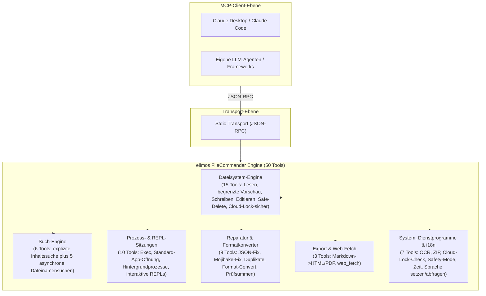
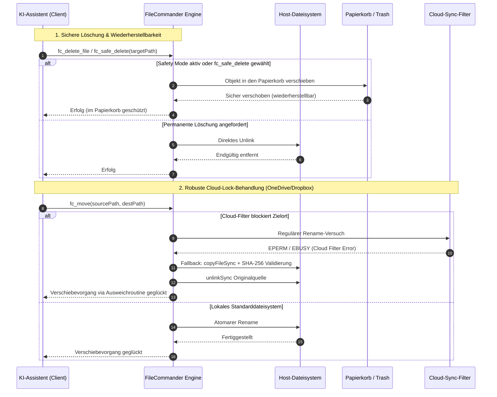

<p align="center">
  
</p>

# ellmos FileCommander MCP Server

**🇬🇧 [English Version](README.md)**

*Teil der [ellmos-ai](https://github.com/ellmos-ai) Familie.*

[](https://opensource.org/licenses/MIT)
[](https://github.com/ellmos-ai/ellmos-filecommander-mcp/actions/workflows/tests.yml)
[](https://www.npmjs.com/package/ellmos-filecommander-mcp)
[](https://nodejs.org/)
[](#tools-übersicht)
[-brightgreen.svg)](#entwicklung)
[](SECURITY.md)
[](SECURITY.md)
[](#warum-filecommander)
[](https://github.com/ellmos-ai)
[](https://github.com/open-bricks)
[](llms.txt)

> **Schnellnavigation:** [Tools-Übersicht](#tools-übersicht) | [Systemarchitektur](#systemarchitektur) | [Kernfähigkeiten & Sicherheitsinvarianten](#kernfähigkeiten--sicherheitsinvarianten) | [Installation](#installation) | [Konfiguration](#konfiguration) | [Vergleich](#vergleich-mit-alternativen) | [Auffindbarkeit](#auffindbarkeit) | [Sicherheit](#sicherheit) | [Ökosystem](#ellmos-ai-ökosystem) | [Sicherheitsrichtlinie](SECURITY.md) | [Changelog](CHANGELOG.md) | [llms.txt](llms.txt)

Ein umfassender **Model Context Protocol (MCP) Server**, der KI-Assistenten vollen Dateisystemzugriff, begrenzte Mehrdatei-Inhaltssuche, Prozessverwaltung, interaktive Shell-Sitzungen und asynchrone Dateinamensuche bietet.

**50 Tools** in einem einzigen Server — alles, was ein KI-Agent für die Interaktion mit dem lokalen System braucht.

**Discovery-Suchbegriffe:** lokaler Dateisystem-MCP-Server, Mehrdatei-Inhaltssuche per MCP, Safe-Delete-MCP, Papierkorb-MCP-Server, Prozessverwaltungs-MCP, interaktive Shell per MCP, asynchrone Dateisuche für KI-Agenten, Cloud-Lock-sichere Dateioperationen, Markdown-zu-PDF-MCP, OCR-MCP-Server, ZIP-Archiv-MCP.

**Registry-Status:** auf [npm](https://www.npmjs.com/package/ellmos-filecommander-mcp) veröffentlicht, über [jsDelivr](https://www.jsdelivr.com/package/npm/ellmos-filecommander-mcp) indexiert, auf [LobeHub](https://lobehub.com/mcp/ellmos-ai-ellmos-filecommander-mcp) sichtbar, auf [Glama](https://glama.ai/mcp/servers/ellmos-ai/ellmos-filecommander-mcp) gelistet und über [`server.json`](server.json) für die offizielle MCP Registry vorbereitet. Einige Drittverzeichnisse zeigen noch ältere 43-Tool-Metadaten; bis deren Reindex durch ist, bleiben README und npm-Metadaten die kanonische Referenz.

> [!NOTE]
> **Für KI-Agenten & LLM-Integrationen:**
> FileCommander bietet **50 spezialisierte Tools**, die über den Standard-stdio-Transport erreichbar sind. Alle Tool-Namen nutzen das `fc_`-Präfix zur Vermeidung von Namenskonflikten. Für LLMs stehen kompakte Kontextübersichten in [`llms.txt`](llms.txt) und [`server.json`](server.json) zur Verfügung.

---

## Warum FileCommander?

Die meisten Dateisystem-MCP-Server decken nur grundlegende Lese-/Schreiboperationen ab. FileCommander geht weiter:

- **Safe Delete** — Verschiebt Dateien in den Papierkorb (Windows) oder Trash (macOS/Linux) statt permanenter Löschung
- **Interaktive Sitzungen** — REPLs starten und bedienen (Python, Node.js, Shells) über das MCP-Protokoll
- **Asynchrone Suche** — Große Verzeichnisbäume im Hintergrund durchsuchen, während die KI weiterarbeitet
- **Explizite Inhaltssuche** — Literalen Text oder reguläre Ausdrücke in einer begrenzten Dateiliste suchen, ohne Rekursion oder Glob-Erweiterung
- **Prozessverwaltung** — Systemprozesse auflisten, starten und beenden
- **String Replace** — Dateien bearbeiten durch eindeutigen Stringabgleich mit Kontextvalidierung
- **Formatkonvertierung** — Konvertierung zwischen JSON, CSV, INI, YAML, TOML, XML und TOON
- **ZIP-Archive** — ZIP-Archive erstellen, entpacken und auflisten
- **Prüfsummen** — MD5-, SHA-1-, SHA-256-, SHA-384- und SHA-512-Hashing mit Vergleichsfunktion
- **OCR** — Texterkennung aus Bildern (optionale tesseract.js-Abhängigkeit)
- **Safety Mode** — Umschalten, damit alle Löschvorgänge über den Papierkorb / Trash laufen
- **Markdown-Export** — Markdown in professionelles HTML/PDF konvertieren mit Codeblöcken, Tabellen, verschachtelten Listen, Blockzitaten
- **Cloud-Lock-sicher** — Automatischer copy+delete-Fallback wenn Cloud-Sync-Filter (OneDrive, Dropbox, Google Drive, iCloud) rename-Operationen blockieren
- **Cloud-Lock-Diagnose** — Prüft ob ein Pfad von Sync-Filter-Konflikten betroffen sein könnte
- **Plattformübergreifend** — Funktioniert auf Windows, macOS und Linux mit plattformspezifischen Optimierungen

---

## Systemarchitektur





---

## Kernfähigkeiten & Sicherheitsinvarianten

| Fähigkeit / Invariante | Garantie & Implementierungsdetails | Sicherheits- & Betriebsvorteil |
|------------------------|-----------------------------------|--------------------------------|
| **Lokales stdio & expliziter Egress** | Der MCP-Transport arbeitet lokal über stdio, ohne Telemetrie und ohne automatischen Netzwerk-Egress. `fc_web_fetch` sendet HTTP(S)-Anfragen nur nach einem ausdrücklichen Client-Aufruf; private Ziele sind standardmäßig gesperrt, sofern `allow_private` nicht aktiviert wird. | Macht die Netzwerkgrenze für Clients sichtbar und behält einen lokalen Servertransport ohne offene Ports bei. |
| **Sicheres Löschen & Papierkorb-Schutz** | `fc_safe_delete` verschiebt Objekte in den Windows-Papierkorb / macOS Trash / Linux FreeDesktop Trash. `fc_set_safe_mode` schützt alle Löschoperationen. | Verhindert irreversiblen Datenverlust bei versehentlichen rekursiven Löschungen. |
| **Cloud-Lock-robuste Verschiebung (`fc_move`)** | Automatische Erkennung von Cloud-Sync-Filter-Sperren (OneDrive, Dropbox, iCloud) mit nahtlosem Copy+Verify+Delete-Fallback. | Beseitigt `EPERM`- und `EBUSY`-Abbrüche bei agentischen Dateioperationen in synchronisierten Ordnern. |
| **Cloud-Lock-Diagnose (`fc_check_cloud_lock`)** | Lesender Bericht über statischen Cloud-Pfadkontext sowie Existenz/Typ des Ziels; Cloud-Files-Hydration und Prozess-Handles werden bei fehlender Prüfung ausdrücklich markiert. | Agenten unterscheiden statisches OneDrive-Risiko von einer tatsächlich erkannten Rename-Sperre. |
| **Begrenzte Mehrdatei-Inhaltssuche** | `fc_search_content` limitiert Eingaben strikt (max. 50 explizite Dateien, 10 MB/Datei, 200 Treffer, 200k Zeichen) ohne Glob-Rekursion. | Verhindert Speicherüberläufe und CPU-Blockaden bei der Analyse großer Repositories. |
| **Automatische Geheimnis- & Token-Schwärzung** | Inhaltsauszüge maskieren bekannte API-Schlüssel, Bearer-Tokens, AWS-Credentials und Authentifizierungs-Header automatisch. | Verhindert Kontext-Kontamination und versehentlichen Abfluss von Zugangsdaten in LLM-Prompts. |
| **Interaktive REPL- & Sitzungs-Isolation** | Zustandsbehaftete interaktive Sitzungen (`fc_start_session`, `fc_send_input`, `fc_read_output`) für Python, Node.js, Bash und PowerShell mit Puffergrenzen. | Ermöglicht mehrstufiges REPL-Debugging ohne unkontrollierte Hintergrundprozesse. |
| **Verlustfreie Multi-Format-Engine** | Deklarative Konvertierung (`fc_convert_format`) über 7 strukturierte Formate (JSON, YAML, TOML, XML, CSV, INI, TOON). | Saubere Datenharmonisierung heterogener Konfigurationsformate ohne Informationsverlust. |
| **Mojibake- & Dateireparatur-Engine** | `fc_fix_encoding`, `fc_fix_json` und `fc_cleanup_file` reparieren fehlerhafte UTF-8-Codierungen (27+ Muster), defekte JSON-Syntax, BOMs und NUL-Bytes. | Selbstheilende Dateipipelines bei plattformübergreifend beschädigten Text- und Datendateien. |
| **Unprivilegierter Non-Elevation-Betrieb** | Ausgelegt und verifiziert für den Betrieb im unprivilegierten Standard-Benutzerkontext ohne Root-/Admin-Rechte. | Minimale Angriffsfläche nach dem Prinzip der geringsten Rechte (Least Privilege). |
| **Sechssprachige Laufzeit-i18n-Engine** | Dynamische Sprachumschaltung und -abfrage (`fc_set_language`, `fc_get_language`) für Deutsch (`de`), Englisch (`en`), Spanisch (`es`), Chinesisch (`zh`), Japanisch (`ja`) und Russisch (`ru`). | Native mehrsprachige Entwicklererfahrung und verständliche Fehlerdiagnostik. |
| **Multi-OS verifizierte CI-Matrix** | Vollständig getestet auf Windows, Ubuntu Linux und macOS unter Node.js 20, 22 und 24 mit 283 automatisierten Assertionen. | Durchgehende Plattformparität und Zuverlässigkeit. |

---

## Installation

### Voraussetzungen

- [Node.js](https://nodejs.org/) 20 oder höher
- npm

### Option 1: Installation über NPM

```bash
npm install -g ellmos-filecommander-mcp
```

### Option 2: Installation aus dem Quellcode

```bash
git clone https://github.com/ellmos-ai/ellmos-filecommander-mcp.git
cd ellmos-filecommander-mcp
npm install
npm run build
```

---

## Konfiguration

### Claude Desktop

Zur `claude_desktop_config.json` hinzufügen:

**Windows:** `%APPDATA%\Claude\claude_desktop_config.json`
**macOS:** `~/Library/Application Support/Claude/claude_desktop_config.json`

#### Bei globaler Installation über NPM:

```json
{
  "mcpServers": {
    "filecommander": {
      "command": "ellmos-filecommander"
    }
  }
}
```

#### Bei Installation aus dem Quellcode:

```json
{
  "mcpServers": {
    "filecommander": {
      "command": "node",
      "args": ["/absolute/path/to/filecommander-mcp/dist/index.js"]
    }
  }
}
```

Claude Desktop nach dem Speichern neu starten.

### Andere MCP-Clients

Der Server kommuniziert über **stdio transport**. Verweisen Sie Ihren MCP-Client auf den `dist/index.js` Einstiegspunkt oder die `ellmos-filecommander` Binary.

---

## Tools-Übersicht

### Dateisystemoperationen (15 Tools)

| Tool | Beschreibung |
|------|-------------|
| `fc_read_file` | Dateiinhalt lesen mit optionalem Zeilenlimit |
| `fc_preview_file` | Zuerst MIME-Typ und Größe prüfen, danach begrenzten Inline-MCP-Inhalt ausdrücklich anfordern |
| `fc_read_multiple_files` | Bis zu 20 Dateien in einem Aufruf lesen |
| `fc_write_file` | Dateien schreiben/erstellen/anhängen |
| `fc_edit_file` | Zeilenbasiertes Bearbeiten (Ersetzen, Einfügen, Löschen) |
| `fc_str_replace` | Eindeutigen String in einer Datei ersetzen mit Kontextvalidierung |
| `fc_list_directory` | Verzeichnisinhalt auflisten (rekursiv, konfigurierbare Tiefe) |
| `fc_create_directory` | Verzeichnisse erstellen (einschließlich Elternverzeichnisse) |
| `fc_delete_file` | Datei löschen (permanent) |
| `fc_delete_directory` | Verzeichnis löschen (mit optionalem rekursivem Flag) |
| `fc_safe_delete` | In Papierkorb / Trash verschieben (wiederherstellbar!) |
| `fc_move` | Dateien und Verzeichnisse verschieben oder umbenennen (Cloud-Lock-sicher) |
| `fc_copy` | Dateien und Verzeichnisse kopieren |
| `fc_file_info` | Detaillierte Dateimetadaten abrufen (Größe, Daten, Typ) |
| `fc_search_files` | Synchrone Dateisuche mit Wildcard-Mustern |

`fc_preview_file` ist der Remote-/Headless-Fallback für lokale Dateien. Der Standardaufruf liefert nur strukturierte Metadaten: aufgelöster Pfad, `file://`-URI, MIME-Typ, Byte-Größe, Vorschauart, festes 1-MiB-Limit und den exakten Folgeaufruf. Inhalt wird erst nach `include_content=true` gelesen. Geeignete Texte und Rasterbilder verwenden Standard-MCP-Content-Blocks vom Typ `text`/`image`; PDFs werden als begrenzte eingebettete `resource` geliefert. Dateien über 1 MiB und nicht unterstützte Typen bleiben metadatenbasiert und werden vom Vorschaupfad nie gelesen oder Base64-kodiert.

### Inhaltssuche (1 Tool)

| Tool | Beschreibung |
|------|-------------|
| `fc_search_content` | Nur lesende Literal- oder Regex-Suche in einer expliziten, geordneten Dateiliste mit Groß-/Kleinschreibung, Kontext sowie globalen und dateibezogenen Limits |

`fc_search_content` erweitert keine Globs, traversiert keine Verzeichnisse und entdeckt keine Dateien rekursiv. Das Tool akzeptiert höchstens 50 explizite UTF-8-Textdateien, überspringt Binärdateien sowie Dateien über 10 MB und liefert deterministisches JSON. Treffer sind auf 200 global und 100 pro Datei begrenzt, Kontext auf 10 Zeilen, Ausschnitte auf 500 Zeichen und die serialisierte Ausgabe auf 200.000 Zeichen. Fehlende, nur in der Cloud vorhandene, unlesbare, falsch kodierte, binäre oder zu große Dateien werden einzeln gemeldet, damit lesbare Dateien weiterhin Ergebnisse liefern. Gängige Secret-Formate werden in Ausschnitten geschwärzt.

### Asynchrone Suche (5 Tools)

| Tool | Beschreibung |
|------|-------------|
| `fc_start_search` | Hintergrundsuche starten (kehrt sofort zurück) |
| `fc_get_search_results` | Ergebnisse mit Paginierung abrufen |
| `fc_stop_search` | Laufende Suche abbrechen |
| `fc_list_searches` | Alle aktiven/abgeschlossenen Suchen auflisten |
| `fc_clear_search` | Abgeschlossene Suchen aus dem Speicher entfernen |

### Prozessverwaltung (5 Tools)

| Tool | Beschreibung |
|------|-------------|
| `fc_execute_command` | Shell-Befehl ausführen (blockierend, mit Timeout) |
| `fc_start_process` | Hintergrundprozess starten (nicht-blockierend) |
| `fc_open_path` | Vorhandene lokale Datei oder Ordner prüfen und mit der Standardanwendung des Betriebssystems öffnen |
| `fc_list_processes` | Laufende Systemprozesse auflisten |
| `fc_kill_process` | Prozess nach PID oder Name beenden |

`fc_open_path` akzeptiert ausschließlich eine vorhandene Datei oder einen Ordner und übergibt das Ziel an einen fest vorgegebenen nativen Standard-Handler. Das strukturierte Ergebnis meldet `launcher_accepted=true|false`, setzt `user_visible` immer auf `"unknown"` und nennt einen maschinenlesbaren Fallback: `fc_preview_file` mit reinen Metadatenargumenten für Dateien oder `fc_list_directory` für Ordner. Eine Launcher-Annahme behauptet nie eine sichtbar geöffnete Oberfläche. Bei `fc_start_process` wählt der Aufrufer dagegen Programm und Argumente. `fc_execute_command` akzeptiert einen beliebigen Shell-Befehl: Für normale Befehle nutzt Node die Standardshell (`COMSPEC`/`cmd.exe` unter Windows); FileCommanders Windows-Pfad für Sonderzeichen kann über Windows PowerShell laufen.

### Interaktive Sitzungen (5 Tools)

| Tool | Beschreibung |
|------|-------------|
| `fc_start_session` | Interaktiven Prozess starten (Python, Node, Shell...) |
| `fc_read_output` | Sitzungsausgabe lesen |
| `fc_send_input` | Eingabe an laufende Sitzung senden |
| `fc_list_sessions` | Alle Sitzungen auflisten |
| `fc_close_session` | Sitzung beenden |

### Dateiwartung & Reparatur (9 Tools)

| Tool | Beschreibung |
|------|-------------|
| `fc_fix_json` | Defektes JSON reparieren (BOM, nachgestellte Kommas, Kommentare, einfache Anführungszeichen) |
| `fc_validate_json` | JSON validieren mit detaillierter Fehlerposition und Kontext |
| `fc_cleanup_file` | BOM, NUL-Bytes, nachgestellte Leerzeichen entfernen, Zeilenenden normalisieren |
| `fc_fix_encoding` | Mojibake / doppelt kodiertes UTF-8 reparieren (27+ Zeichenmuster) |
| `fc_folder_diff` | Verzeichnisänderungen mit Snapshots verfolgen (neu/geändert/gelöscht) |
| `fc_batch_rename` | Musterbasierte Massenumbenennung (Präfix/Suffix, Ersetzen, Auto-Erkennung) |
| `fc_convert_format` | Konvertierung zwischen JSON, CSV, INI, YAML, TOML, XML und TOON |
| `fc_detect_duplicates` | Doppelte Dateien mittels SHA-256-Hashing finden |
| `fc_checksum` | Datei-Hashing (MD5, SHA-1, SHA-256, SHA-384, SHA-512) mit optionalem Vergleich |

### Archiv (1 Tool)

| Tool | Beschreibung |
|------|-------------|
| `fc_archive` | ZIP-Archive erstellen, entpacken und auflisten |

### OCR (1 Tool)

| Tool | Beschreibung |
|------|-------------|
| `fc_ocr` | Texterkennung aus Bildern über tesseract.js (optionale Abhängigkeit) |

### Cloud Sync (1 Tool)

| Tool | Beschreibung |
|------|-------------|
| `fc_check_cloud_lock` | Meldet statischen Cloud-Sync-Kontext und Zielzustand; behauptet ohne Beleg keine aktive Sperre (Windows) |

### System (4 Tools)

| Tool | Beschreibung |
|------|-------------|
| `fc_get_time` | Aktuelle Systemzeit mit Zeitzoneninformation abrufen |
| `fc_set_safe_mode` | Safety Mode umschalten: alle Löschvorgänge über Papierkorb / Trash |
| `fc_set_language` | Laufzeitsprache auf `de`, `en`, `es`, `zh`, `ja` oder `ru` umschalten |
| `fc_get_language` | Aktive Laufzeitsprache und alle unterstützten Sprachcodes abfragen |

### Export (2 Tools)

| Tool | Beschreibung |
|------|-------------|
| `fc_md_to_html` | Markdown zu eigenständigem HTML mit CSS-Styling (Überschriften, Codeblöcke, Tabellen, verschachtelte Listen, Blockzitate, Bilder, Checkboxen) |
| `fc_md_to_pdf` | Markdown zu PDF über Headless-Browser (Edge/Chrome). Fällt auf HTML zurück, wenn kein Browser verfügbar ist |

### Web (1 Tool)

| Tool | Beschreibung |
|------|-------------|
| `fc_web_fetch` | Ruft eine Webseite ab und gibt Inhalt je nach `mode` zurück: extract (sauberer Haupttext), raw (HTTP-Body), links, forms oder headers. Nur lesendes Netzwerk-Tool; SSRF-Schutz blockiert interne/private Ziele standardmäßig. |

**Gesamt: 50 Tools**

---

## Vergleich mit Alternativen

| Feature | FileCommander | [Desktop Commander](https://github.com/wonderwhy-er/DesktopCommanderMCP) | [Official Filesystem](https://www.npmjs.com/package/@modelcontextprotocol/server-filesystem) |
|---------|:---:|:---:|:---:|
| Dateien lesen/schreiben/kopieren/verschieben | 14 Tools | Ja | Ja |
| Safe Delete (Papierkorb) | Ja | Nein | Nein |
| Explizite Mehrdatei-Inhaltssuche | Ja | Nein | Nein |
| Asynchrone Hintergrundsuche | 5 Tools | Nein | Nein |
| Interaktive Sitzungen (REPL) | 5 Tools | Ja | Nein |
| Prozessverwaltung | 5 Tools | Ja | Nein |
| Shell-Befehlsausführung | Ja | Ja | Nein |
| String Replace mit Validierung | Ja | Ja | Nein |
| Zeilenbasierte Dateibearbeitung | Ja | Nein | Nein |
| JSON-Reparatur & Validierung | 2 Tools | Nein | Nein |
| Encoding-Reparatur (Mojibake) | Ja | Nein | Nein |
| Duplikaterkennung (SHA-256) | Ja | Nein | Nein |
| Verzeichnis-Diff / Änderungsverfolgung | Ja | Nein | Nein |
| Massenumbenennung (musterbasiert) | Ja | Nein | Nein |
| Formatkonvertierung (JSON/CSV/INI/YAML/TOML/XML/TOON) | Ja | Nein | Nein |
| ZIP-Archiv (erstellen/entpacken/auflisten) | Ja | Nein | Nein |
| Datei-Prüfsummen (MD5/SHA-1/SHA-256/SHA-384/SHA-512) | Ja | Nein | Nein |
| OCR (Bild zu Text) | Optional | Nein | Nein |
| Safety Mode (Löschen → Papierkorb) | Ja | Nein | Nein |
| Pfad-Allowlist / Sandboxing | Nein | Nein | Ja |
| Excel / PDF-Unterstützung | PDF (über Browser) | Ja | Nein |
| HTTP Transport | Nein | Nein | Nein |
| Markdown zu HTML/PDF Export | Ja | Nein | Nein |
| **Tools gesamt** | **50** | ~15 | ~11 |
| **Benötigte Server** | **1** | 1 | + extra für Prozesse |

**Hauptunterscheidungsmerkmale:**
- Einziger MCP-Server mit **wiederherstellbarem Löschen** (Papierkorb / Trash)
- Einziger MCP-Server mit **asynchroner Hintergrundsuche** mit Paginierung
- Integrierte **JSON-Reparatur**, **Encoding-Korrektur** und **Duplikaterkennung**
- Einziger MCP-Server mit **Cloud-Lock-sicheren Dateioperationen** (automatischer copy+delete-Fallback)
- Umfassendste Einzelserver-Lösung (50 Tools)
- Integrierter **Safety Mode** zur Vermeidung versehentlicher permanenter Löschungen

---

## Tool-Präfix

Alle Tools verwenden das `fc_`-Präfix (FileCommander), um Konflikte mit anderen MCP-Servern zu vermeiden.

---

## Auffindbarkeit

FileCommander ist so dokumentiert, dass Menschen, LLMs und MCP-Verzeichnisse ihn eindeutig einordnen können:

- `package.json` enthält den offiziellen `mcpName` (`io.github.ellmos-ai/ellmos-filecommander-mcp`) und MCP-spezifische npm-Keywords.
- [`server.json`](server.json) folgt dem offiziellen MCP-Registry-Schema und verweist auf das npm-Paket.
- [`glama.json`](glama.json) liefert Metadaten für Glama-kompatible MCP-Verzeichnisse.
- [`llms.txt`](llms.txt) bietet kompakten Kontext für LLMs, Agentenkataloge und Dokumentations-Crawler.

Primäre Suchbegriffe: `ellmos-filecommander-mcp`, `FileCommander MCP`, `filesystem MCP server`, `multi-file content search MCP`, `safe delete MCP`, `async file search MCP`, `process management MCP`, `Markdown PDF MCP`.

Externe Auffindbarkeit: npm und jsDelivr können dem aktuellen Release kurzzeitig hinterherhinken. LobeHub indexiert das GitHub-Repo als MCP-Server. Die Paketbeschreibung und diese README sind die kanonische 50-Tool-Referenz für den aktuellen Repository-Stand.

---

## Sicherheit

**Dieser Server hat vollen Dateisystemzugriff mit den Berechtigungen des ausführenden Benutzers.**

Siehe [SECURITY.md](SECURITY.md) für detaillierte Sicherheitsinformationen und Empfehlungen.

Wichtige Punkte:
- `fc_execute_command` führt beliebige Shell-Befehle aus
- `fc_open_path` startet für einen vom Aufrufer gewählten vorhandenen Pfad die zugeordnete Betriebssystem-Anwendung; diese läuft mit den Berechtigungen des Benutzers
- `fc_open_path` meldet Launcher-Annahme getrennt vom invarianten `user_visible="unknown"`; `fc_preview_file` ist der metadatenbasierte Remote-Fallback mit ausdrücklicher 1-MiB-Inline-Grenze
- `fc_start_session` startet einen beliebigen interaktiven Befehl; nachfolgende `fc_send_input`-Aufrufe können weitere Aktionen ausführen
- `fc_delete_*` Tools löschen standardmäßig permanent (verwenden Sie `fc_safe_delete` oder aktivieren Sie den **Safety Mode** über `fc_set_safe_mode`, um alle Löschvorgänge über den Papierkorb / Trash zu leiten)
- Der Safety Mode schützt ausschließlich `fc_delete_file` und `fc_delete_directory`; er schränkt Befehle oder interaktive Sitzungen nicht ein
- Der Servertransport ist lokales stdio ohne Telemetrie; ein expliziter `fc_web_fetch`-Aufruf führt jedoch ausgehenden HTTP(S)-Zugriff aus
- Kein eingebautes Sandboxing — die Sicherheit wird an die MCP-Client-Schicht delegiert

---

## Entwicklung

```bash
# Abhängigkeiten installieren
npm install

# Watch-Modus (automatischer Rebuild bei Änderungen)
npm run dev

# Einmaliger Build
npm run build

# Server starten
npm start

# Tests ausführen
npm test
```

### Tests

Das Projekt enthält **212 Vitest-Tests plus 71 eigenständige i18n-Prüfungen (283 insgesamt)** für Dateisystemoperationen, metadatenbasierte Inline-Vorschau, begrenzte Inhaltssuche, native Standard-Handler-Aufrufe, Formatkonvertierung, Encoding-Reparatur, Archiv-Handling, Duplikaterkennung, Sprachpakete, Tool-Annotationen, echtes stdio-Verhalten und Sicherheitsgrenzen.

```bash
npm test              # Alle Tests ausführen
node test-i18n.mjs    # Eigenständige i18n-Prüfungen ausführen
npx vitest --watch    # Watch-Modus
```

Tests sind auf **Windows**, **macOS** und **Linux** verifiziert.
Pushes und Pull Requests laufen in CI auf Node.js **20**, **22** und **24** mit `npm ci`, TypeScript-Build, Vitest und npm-Paket-Dry-Run.

Siehe [CONTRIBUTING.md](CONTRIBUTING.md) für Richtlinien zur Mitwirkung.

---

## Änderungsprotokoll

Siehe [CHANGELOG.md](CHANGELOG.md) für die vollständige Versionshistorie.

---

## Lizenz

[MIT](LICENSE) — Lukas Geiger ([ellmos-ai](https://github.com/ellmos-ai))

---

## Geschichte

Dieses Projekt wurde ursprünglich als **BACH FileCommander** (`bach-filecommander-mcp`) entwickelt. Es wurde im Rahmen der [ellmos-ai](https://github.com/ellmos-ai) Organisation in **ellmos FileCommander** (`ellmos-filecommander-mcp`) umbenannt.

Der alte Paketname `bach-filecommander-mcp` ist veraltet. Bitte verwenden Sie stattdessen [`ellmos-filecommander-mcp`](https://www.npmjs.com/package/ellmos-filecommander-mcp):

```bash
npm uninstall -g bach-filecommander-mcp
npm install -g ellmos-filecommander-mcp
```

---

## ellmos-ai-Ökosystem

Dieser MCP-Server ist Teil des **[ellmos-ai](https://github.com/ellmos-ai)**-Ökosystems — KI-Infrastruktur, MCP-Server und intelligente Werkzeuge.

### MCP-Server-Familie

| Server | Tools | Fokus | npm |
|--------|-------|-------|-----|
| **[FileCommander](https://github.com/ellmos-ai/ellmos-filecommander-mcp)** | **50** | **Dateisystem, begrenzte Inline-Vorschau, Inhaltssuche, Standard-App-Öffnung, Prozessverwaltung, interaktive Sitzungen, Cloud-Lock-sichere Operationen** | **[`ellmos-filecommander-mcp`](https://www.npmjs.com/package/ellmos-filecommander-mcp)** |
| [CodeCommander](https://github.com/ellmos-ai/ellmos-codecommander-mcp) | 22 | Code-Analyse, JSON-Reparatur, Imports, Diffs, Regex | [`ellmos-codecommander-mcp`](https://www.npmjs.com/package/ellmos-codecommander-mcp) |
| [Clatcher](https://github.com/ellmos-ai/ellmos-clatcher-mcp) | 12 | Dateireparatur, Formatkonvertierung, Batch-Operationen | [`ellmos-clatcher-mcp`](https://www.npmjs.com/package/ellmos-clatcher-mcp) |
| [n8n Manager](https://github.com/ellmos-ai/n8n-manager-mcp) | 19 | n8n-Workflow-Verwaltung über KI-Assistenten | [`n8n-manager-mcp`](https://www.npmjs.com/package/n8n-manager-mcp) |
| [ControlCenter](https://github.com/ellmos-ai/ellmos-controlcenter-mcp) | 31 | MCP-Stack-Discovery, Profilverwaltung, Control Plane | [`ellmos-controlcenter-mcp`](https://www.npmjs.com/package/ellmos-controlcenter-mcp) |
| [Homebase](https://github.com/ellmos-ai/ellmos-homebase-mcp) | 45 | Local-first LLM-Gedächtnis, Wissen, Zustand, Routing, Schwarm-Orchestrierung | [`ellmos-homebase-mcp`](https://www.npmjs.com/package/ellmos-homebase-mcp) (alpha) |
| [ServerCommander](https://github.com/ellmos-ai/ellmos-servercommander-mcp) | 8 | Server-Operationen: Health-Checks, Log-Analyse, Deploy-Dry-Runs, Mail-Diagnose | [`ellmos-servercommander-mcp`](https://www.npmjs.com/package/ellmos-servercommander-mcp) (alpha) |
| [Blender Use](https://github.com/ellmos-ai/ellmos-blender-use-mcp) | 5 | Headless Blender-Asset-QA und FBX-Reimport-Verifikation | [`ellmos-blender-use-mcp`](https://www.npmjs.com/package/ellmos-blender-use-mcp) (alpha) |
| [Open Compute](https://github.com/ellmos-ai/open-compute-mcp) | 16 | Modell-agnostischer Computer-Use: Capture, safety-gated Aktionen, Windows-UIA | [`open-compute-mcp`](https://www.npmjs.com/package/open-compute-mcp) (alpha) |

### KI-Infrastruktur

| Projekt | Beschreibung |
|---------|-------------|
| [BACH](https://github.com/ellmos-ai/bach) | Local-first textbasiertes OS für LLM-Agenten — 113+ Handler, 550+ Tools, SQLite-Memory |
| [open-compute](https://github.com/ellmos-ai/open-compute) | Modell-agnostischer Computer-Use-Kern hinter Open Compute MCP |
| [clutch](https://github.com/ellmos-ai/clutch) | Provider-neutrale LLM-Orchestrierung mit Auto-Routing und Budget-Tracking |
| [rinnsal](https://github.com/ellmos-ai/rinnsal) | Leichte Agent-Memory-, Connector- und Automatisierungsinfrastruktur |
| [ellmos-stack](https://github.com/ellmos-ai/ellmos-stack) | Self-hosted AI Research Stack (Ollama + n8n + Rinnsal + KnowledgeDigest) |
| [MarbleRun](https://github.com/ellmos-ai/MarbleRun) | Autonomes Agent-Chain-Framework für Claude Code |
| [gardener](https://github.com/ellmos-ai/gardener) | Minimalistischer datenbankgetriebener LLM-OS-Prototyp (4 Funktionen, 1 Tabelle) |
| [ellmos-tests](https://github.com/ellmos-ai/ellmos-tests) | Testframework für LLM-Betriebssysteme (7 Dimensionen) |

### Desktop-Software & Geschwister-Anwendungen

Unsere Partnerorganisation **[open-bricks](https://github.com/open-bricks)** und ihre Line-Organisationen bieten KI-native Desktop-Anwendungen und Entwickler-Tools:

| Anwendung | Kategorie | Organisation | Fokus |
|-----------|-----------|--------------|-------|
| [ProFiler](https://github.com/file-bricks/ProFiler) | Dateiverwaltung | file-bricks | Hochleistungs-Zweifenster-Dateimanager mit KI-Integration |
| [ExplorerPro](https://github.com/file-bricks/ExplorerPro) | Dateiexploration | file-bricks | Intelligenter Dateiexplorer mit semantischen Filtern & Vorschau |
| [WinStorePackager](https://github.com/file-bricks/WinStorePackager) | Paketierung | file-bricks | MSIX- & Microsoft Store-Paketierung für Windows-Desktop-Apps |
| [SoftwareCenter](https://github.com/file-bricks/SoftwareCenter) | App Store | file-bricks | Zentrales Desktop-Paketmanagement und Software-Verteilung |
| [SQLiteViewer](https://github.com/file-bricks/SQLiteViewer) | Datenbank-Tool | file-bricks | Schlanker SQLite-Inspektor und Query-Editor |
| [DokuZen](https://github.com/doc-bricks/DokuZen) | Markdown-Suite | doc-bricks | Markdown-Editor, PDF-Export & Dokumentenkonvertierung |
| [MediaBrain](https://github.com/doc-bricks/MediaBrain) | Dokumente / Medien | doc-bricks | Audio-/Video-Transkription, Metadaten-Extraktion & Katalogisierung |
| [UniversalInvoiceMail](https://github.com/doc-bricks/UniversalInvoiceMail) | Dokumente / Mail | doc-bricks | Automatische Rechnungserkennung, PDF-Extraktion & Mail-Routing |
| [DevCenter](https://github.com/dev-bricks/DevCenter) | Entwickler-Suite | dev-bricks | Integrierter Werkzeugkasten für Entwickler, Code-Analysen & Generatoren |
| [CodeBox](https://github.com/dev-bricks/CodeBox) | Code-Editor | dev-bricks | Mehrsprachiger Code-Editor mit LLM-Unterstützung |
| [safe-start-for-codex](https://github.com/dev-bricks/safe-start-for-codex) | Sicherheit & Audit | dev-bricks | Gehärtete Laufzeitumgebung & Pre-Flight-Prüfer für Codex |
| [automation-master](https://github.com/dev-bricks/automation-master) | Aufgaben-Automatisierung | dev-bricks | Hochzuverlässiger Hintergrund-Automations-Runner & Scheduler |

